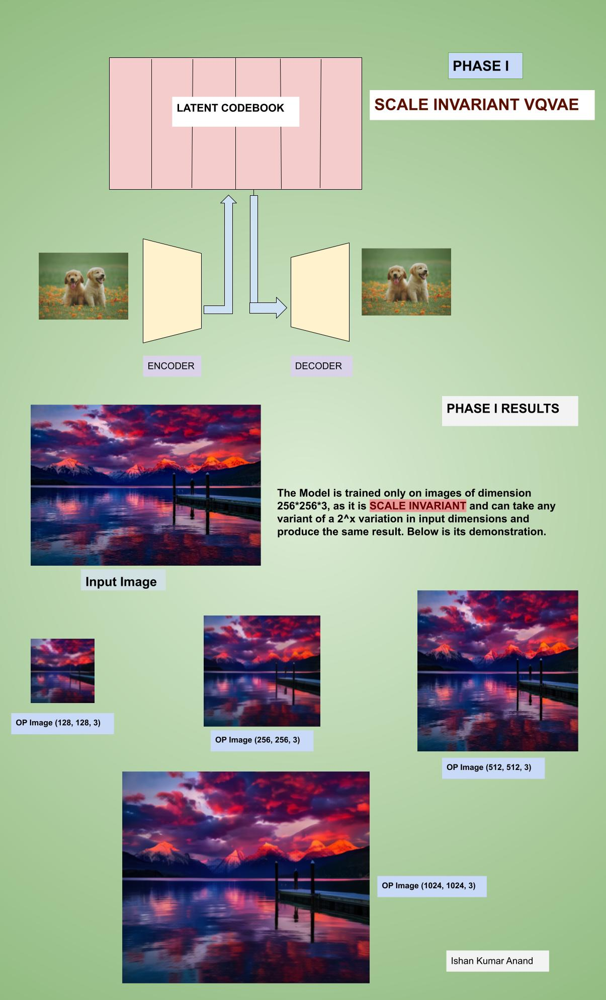
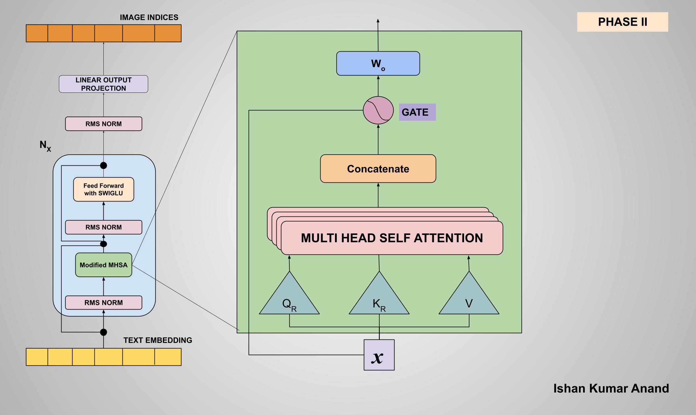

# Hybrid-Architecture-T2I
In Progress Project :: Trying My own New Architecture for Text To Image Generation with an Hybrid Approach Training the Architecture with Embeddings rather than Tokens inspired from LJEPA Paper.

## Results of Architecture Learning to Identify Colors

{It is just trained for about 65 Epochs}

The Project is divided in 2 phases, 
Phase 1: Training the VQVAE on Images, such that codebook learns to produce latents of any sort of Images.
Phase 2: Is to train a Transformer which takes input Text Embedding and produces Image Latents, which then we can decode and generate images from VQVAE.

## Phase 1
Phase 1 is Training the VQVAE to Convert Images to Indices

## Phase 2
Phase 2 is Training the Decoder to predict Image Indices from Text Embedding

<!-- 
Like I have got quite good Ideas to use on, like
- The Intution from Nested Learning Paper of alpha, beta, gamma, delta and theta waves, infuse this ideology in Transformer Architecture such that it behaves as brain like waves each responsible for different functionality
- Infuse SwiGLU Architecture, Llama paper showed it it didn't give proper reason why it's working but it works better the GeLU or ReLU
- Infuse Rotatory PE in Q and K
- RMS Norm
- Gating Mechanism in Transformer, it's one of the award winning paper in Neurips 2025, I can include that
- Obviously TRM as well, I have included it in my previous Architecture as well
- New Idea of Hyper-Connections, a recent paper from DeepSeek is also a fine work which showed it possibility over Normal single lane channel training.. 
- Other Idea of multiple Text Encoder (Qwen, BGE,  etc) nut I don't have that much memory to load all of them and train, I would use Qwen for this project.

Well, but I don't have that much GPU, to try everything hence will come up with something efficient

- I am thinking to scrape the Diffusion process entirely, but to produce fine refinement image we need the denoising step again and again. So, what to do
you know why not just include the denoising process during the forward propagation. 

- I have other thought of why not try it with VEctorized-VAE (VQVAE).. I mean take in the concept of the CodeBook and utilize it as memory and latent representation ?, wanna give it a try ? let's see

## The Main Idea would be to work in latent space rather than pixel space and token Space, This idea is from JePA papers like LJepa, VLJepa and the world Models which tries to train everything in the latent space and they have performed great results improvement.

Cool, After certain researching and paper reading.. 
No one has tried the approach of VQVAE + Transformer... for text to Image Generation... well let's try it out.. 
Remeber we succeded greatly when doing text to Video using VQVAE.. that really showed good results, hopefully this works out well.

Have Started the VQVAE Pipeline Training over the Image latents when it is compressed on by DCAE -->